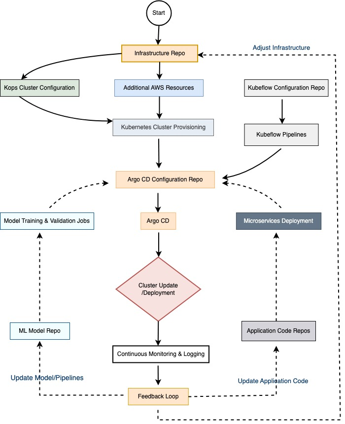

# Distributed-Machine-Learning-System
- **System Setup**
  - **Kubernetes**: Serves as the orchestration backbone, managing containerized applications across a cluster of machines.
  - **Kops**: Utilized to automate the provisioning of Kubernetes clusters on AWS, ensuring that the setup is optimized for high availability and scalability.
  - **Kubeflow**: Provides a suite of tools to manage machine learning workflows, from experiment tracking to pipeline deployment.
  - **Argo CD**: Manages continuous deployment for Kubernetes, ensuring that applications are automatically updated in a declarative manner.
  - **AWS**: Offers robust cloud infrastructure, providing scalable and secure computing resources.
This configuration employs best practices to significantly enhance scalability, maintainability, and efficiency throughout the modeling process.

- **Distributed Model Training**: Utilizes TensorFlow's TFJob to orchestrate the distributed training of machine learning models. TFJob is a Kubernetes custom resource specifically designed for TensorFlow tasks, allowing the execution of scalable and resilient training jobs across multiple computing nodes in the cluster. This approach not only enhances the training process through parallel computation but also integrates seamlessly with the Kubernetes ecosystem, ensuring that each component of the model training phase can be closely monitored and managed.

- **Model Serving**: For the deployment and serving of trained models, the system employs KService, part of the Knative project, which provides a serverless framework to enable automatic scaling up and down to zero. KService abstracts away much of the complexity involved in deploying and managing models in production environments. It offers features such as revision control, custom routing, and rapid scaling, which are crucial for handling fluctuating loads efficiently.

- **Job and Task Submission APIs**: To complement the automated processes, the system also includes various APIs designed to handle manual submissions of jobs and tasks. These APIs provide developers and data scientists with the flexibility to initiate processes, adjust parameters, or trigger re-training cycles on-demand. This capability is particularly useful in scenarios where adjustments or interventions are required based on evolving data patterns or when deploying new models into production.

This configuration embraces industry best practices to enhance scalability, maintainability, and efficiency throughout the modeling process.

## workflow

## structure of distributed-machine-learning-system
distributed-machine-learning-system comprises 6 repositories 
- infra-repo
- k8s-config-repo
- kubelow-config-repo
- ml-model-repo
- app-repo
- docs-repo